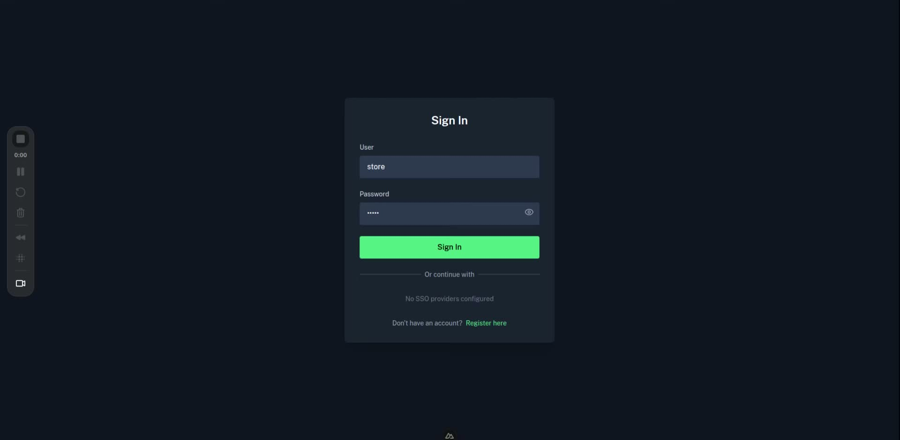
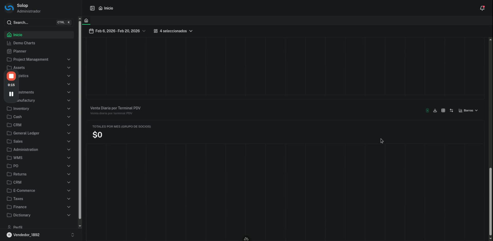
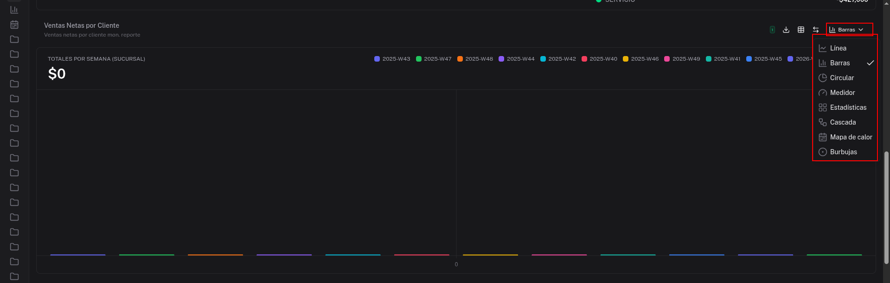
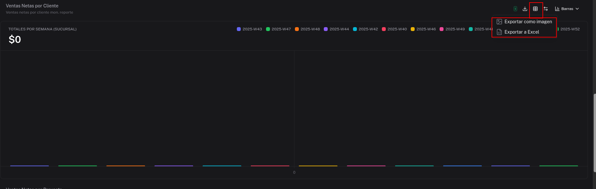
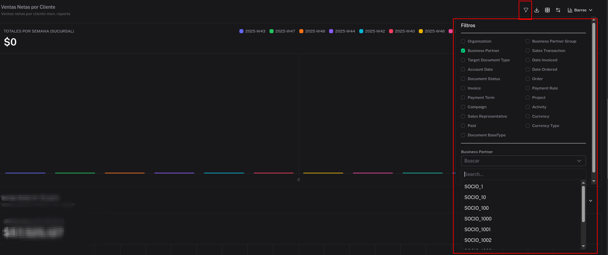
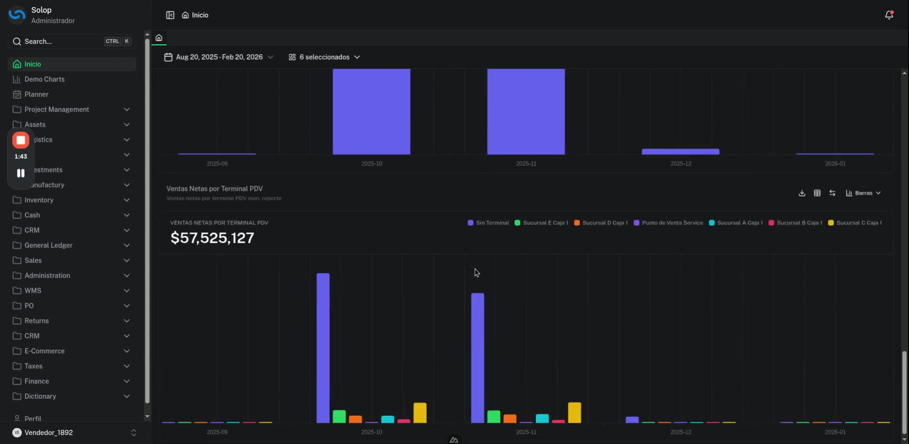
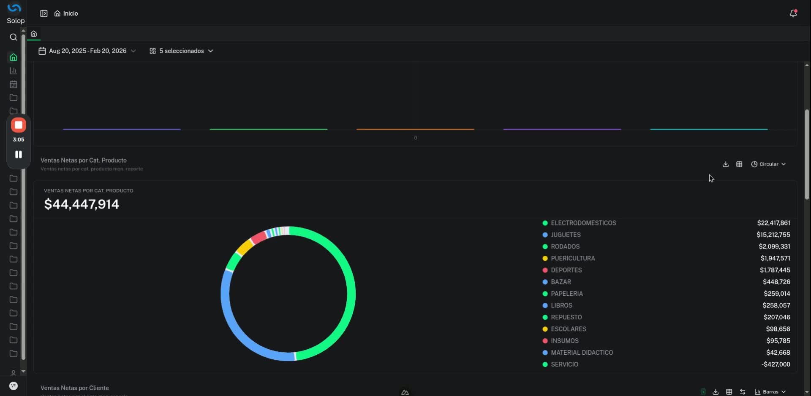

# Gráficos

## Descripción

La funcionalidad de **Gráficos** (Demo Charts) en Solop ERP permite a los usuarios visualizar indicadores de ventas mediante paneles interactivos con múltiples tipos de representación gráfica. Los paneles se actualizan dinámicamente según el rango de fechas y los filtros aplicados, y los datos pueden exportarse como imagen o como archivo Excel.

Esta funcionalidad está disponible en la interfaz moderna (Nuxt) de Solop ERP, accesible desde el menú **Demo Charts**.

## ¿Cuándo se utiliza?

Se utiliza cuando el usuario necesita:

- Visualizar ventas por terminal PDV, categoría de producto, vendedor o cliente en un único dashboard.
- Comparar el comportamiento de ventas en distintos períodos de tiempo.
- Cambiar el tipo de gráfico (barras, líneas, circular, etc.) para una mejor representación visual.
- Exportar gráficos individuales como imagen o datos en Excel.
- Filtrar información por socio de negocio, organización, moneda u otros criterios avanzados.

## Acceso

**Menú Principal → Demo Charts**

Una vez dentro, el sistema presenta el listado de paneles disponibles para el rol del usuario.

## Interfaz Principal

La pantalla de Gráficos presenta los siguientes elementos:

- **Barra de fecha**: selector de rango de fechas aplicado a todos los paneles activos.
- **Selector de paneles**: permite elegir cuáles paneles mostrar (por ejemplo: "4 seleccionados" o "6 seleccionados").
- **Paneles de gráficos**: cada panel muestra un indicador independiente con sus propios controles de tipo de gráfico, exportación y filtros.

## Paneles Disponibles

| Panel | Descripción |
|-------|-------------|
| Venta Diaria por Terminal PDV | Muestra las ventas diarias agrupadas por terminal punto de venta |
| Ventas Netas por Terminal PDV | Muestra el total de ventas netas desglosado por cada terminal PDV y sucursal |
| Ventas Netas por Cat. Producto | Muestra la distribución de ventas netas por categoría de producto |
| Ventas Netas por Vendedor | Muestra las ventas netas agrupadas por vendedor |
| Ventas Netas por Cliente | Muestra las ventas netas agrupadas por cliente o socio de negocio |
| Ventas Netas por Producto | Muestra las ventas netas desglosadas por producto individual |

## Controles de Cada Panel

Cada panel de gráfico cuenta con un conjunto de iconos en la esquina superior derecha:

| Ícono | Función |
|-------|---------|
| Filtro (embudo) | Abre el panel de filtros avanzados del gráfico |
| Descargar | Despliega las opciones de exportación (imagen o Excel) |
| Tabla | Muestra u oculta la tabla de datos asociada al gráfico |
| Refrescar | Actualiza los datos del panel |
| Tipo de gráfico | Selector del tipo de visualización |

## Tipos de Gráfico Disponibles

Cada panel permite cambiar el tipo de representación visual desde el selector ubicado en la esquina superior derecha:

| Tipo | Descripción |
|------|-------------|
| Línea | Gráfico de líneas, ideal para visualizar tendencias en el tiempo |
| Barras | Gráfico de barras agrupadas o apiladas (opción predeterminada) |
| Circular | Gráfico de torta o dona, útil para comparar proporciones |
| Medidor | Indicador tipo velocímetro para valores únicos |
| Estadísticas | Vista de resumen estadístico |
| Cascada | Gráfico de cascada (waterfall) para mostrar variaciones acumuladas |
| Mapa de calor | Representación en cuadrícula con intensidad de color según valor |
| Burbujas | Gráfico de burbujas para comparar tres dimensiones simultáneamente |

## Exportación de Gráficos

Cada panel permite exportar su contenido mediante el ícono de descarga:

| Opción | Descripción |
|--------|-------------|
| Exportar como imagen | Descarga el gráfico actual como archivo de imagen (PNG) |
| Exportar a Excel | Descarga los datos subyacentes del gráfico en formato Excel |

## Filtros Avanzados

Al hacer clic en el ícono de filtro (embudo) de cualquier panel, se despliega un panel lateral con los criterios de filtrado disponibles:

| Filtro | Descripción |
|--------|-------------|
| Organization | Filtra por organización |
| Business Partner | Filtra por socio de negocio (cliente o proveedor) |
| Business Partner Group | Filtra por grupo de socios de negocio |
| Target Document Type | Filtra por tipo de documento destino |
| Sales Transaction | Filtra por tipo de transacción de venta |
| Date Invoiced | Filtra por fecha de factura |
| Account Date | Filtra por fecha contable |
| Date Ordered | Filtra por fecha de pedido |
| Document Status | Filtra por estado del documento |
| Order | Filtra por pedido específico |
| Invoice | Filtra por factura específica |
| Payment Rule | Filtra por regla de pago |
| Payment Term | Filtra por término de pago |
| Project | Filtra por proyecto |
| Campaign | Filtra por campaña |
| Activity | Filtra por actividad |
| Sales Representative | Filtra por representante de ventas |
| Currency | Filtra por moneda |
| Paid | Filtra por estado de pago |
| Currency Type | Filtra por tipo de moneda |
| Document BaseType | Filtra por tipo base de documento |

## Flujo del Proceso

**Paso 1: Iniciar sesión**

Acceder a Solop ERP con las credenciales correspondientes (usuario y contraseña).

**Paso 2: Navegar a Demo Charts**

Desde el menú lateral izquierdo, seleccionar **Demo Charts** para ingresar al módulo de gráficos.

**Paso 3: Seleccionar los paneles a visualizar**

Usar el selector de paneles (por ejemplo, "4 seleccionados") para elegir cuáles paneles mostrar en el dashboard.

**Paso 4: Configurar el filtro de fechas**

Hacer clic en el selector de rango de fechas ubicado en la barra superior. Desplegar el calendario y elegir las fechas de inicio y fin del período a analizar.

**Paso 5: Cargar y verificar los gráficos**

Esperar a que los datos se carguen en cada panel. Verificar que los totales y las representaciones gráficas sean correctas.

**Paso 6: Cambiar el tipo de gráfico (opcional)**

Para cada panel, hacer clic en el selector de tipo de gráfico (esquina superior derecha) y elegir la visualización más adecuada. Los datos se mantienen consistentes al cambiar el tipo.

**Paso 7: Mostrar u ocultar la tabla de datos (opcional)**

Hacer clic en el ícono de tabla para mostrar u ocultar la tabla de datos asociada al gráfico del panel activo.

**Paso 8: Aplicar filtros avanzados (opcional)**

Hacer clic en el ícono de filtro (embudo) del panel correspondiente. Seleccionar los criterios deseados (por ejemplo, filtrar por **Business Partner**) y buscar el valor específico desde el campo de búsqueda.

**Paso 9: Exportar el gráfico**

Hacer clic en el ícono de descarga del panel y seleccionar la opción deseada: **Exportar como imagen** para guardar el gráfico en PNG, o **Exportar a Excel** para obtener los datos tabulados.

## Consideraciones Importantes

- Asegurarse de contar con las **credenciales correctas** antes de iniciar sesión.
- Verificar que el **filtro de fechas** esté configurado correctamente para evitar que los gráficos muestren datos vacíos o de períodos no deseados.
- Los paneles con datos insuficientes para el período seleccionado mostrarán un total de **$0** y el gráfico aparecerá vacío.
- Los **filtros avanzados** son independientes por panel; configurar el filtro en un panel no afecta a los demás.
- La opción **Exportar a Excel** es útil cuando se requiere realizar análisis adicionales fuera del sistema.
- Familiarizarse con los distintos **tipos de gráfico** disponibles para elegir la representación más adecuada según los datos a comunicar.

## Ejemplo de Uso

**Escenario:** El equipo de ventas necesita revisar la distribución de ventas netas por categoría de producto para el período agosto 2025 - febrero 2026 y compartir el resultado con la gerencia.

1. El usuario inicia sesión en Solop ERP y accede a **Demo Charts**.
2. Configura el rango de fechas: **Aug 20, 2025 – Feb 20, 2026**.
3. Activa el panel **Ventas Netas por Cat. Producto** desde el selector de paneles.
4. El sistema carga el gráfico de barras mostrando un total de **$44,447,914** distribuido entre categorías como Electrodomésticos ($22,417,861), Juguetes ($15,212,755), Rodados ($2,099,331), entre otras.
5. El usuario cambia el tipo de gráfico a **Circular** para visualizar las proporciones de cada categoría.
6. Hace clic en **Exportar como imagen** para obtener el gráfico en PNG y adjuntarlo en el reporte de gerencia.
